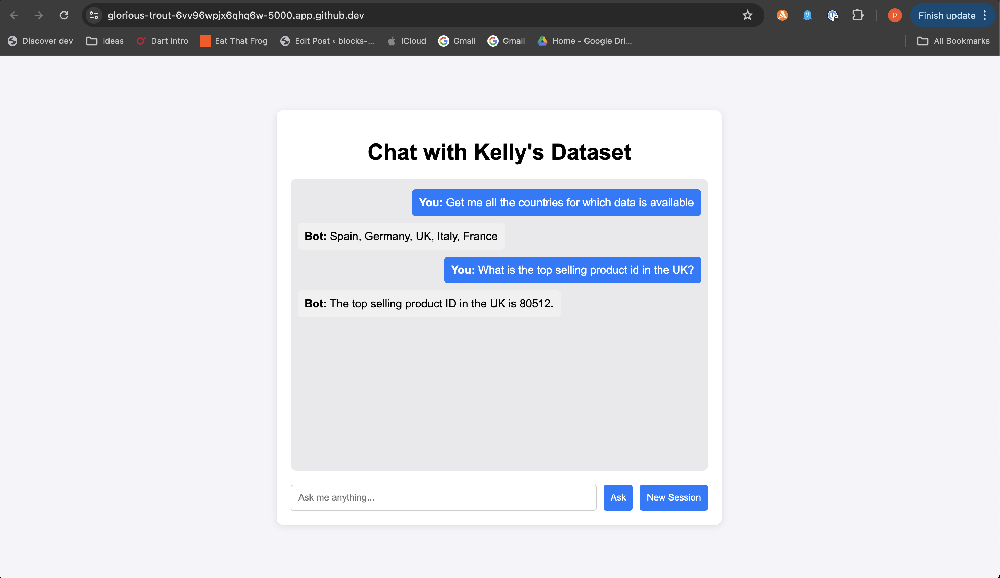

# GROUP 3 CAPSTONE PROJECT - GRAPH RAG

Switch to the **`assignment`** folder

## Install all the required packages
In a terminal run
```
pip install -r requirements.txt
```

## Configure Keys
* Create an account in Neo4J and get params like `url`, `username` and `password`. For example:
    - url: `bolt+s://xxxxxxxx.databases.neo4j.io:7687`
    - username: `neo4j`
* Either export them as env variables or configure Neo4J keys in `db_setup.py` here (while initializing graph)
    - ```
        graph = Neo4jGraph(
            url=os.environ["NEO4J_URI"],
            username=os.environ["NEO4J_USERNAME"],
            password=os.environ["NEO4J_PASSWORD"]
        )
      ```
* Configure LLM and Neo4J Keys in `custom_qa_chain -> CustomQAChain -> setup_keys()` method

## Setup Neo4J DB

* Run the following to setup DB with Kelly's Dataset
    ```
    python db_setup.py
    ```
    - It should return output something like this:
        ```
        Deleted all the existing records
        Loaded Kellys dataset to Neo4J
        created schema:
        Node properties:
        Country {name: STRING}
        Store {id: INTEGER, country: STRING}
        ProductCategory {name: STRING}
        Product {id: INTEGER, category: STRING}
        Sale {id: INTEGER, date: DATE, gdpGrowth: FLOAT, price: FLOAT, unitsSold: INTEGER, inflation: FLOAT}
        Relationship properties:

        The relationships:
        (:Store)-[:LOCATED_IN]->(:Country)
        (:Store)-[:SOLD]->(:Sale)
        (:Product)-[:BELONGS_TO]->(:ProductCategory)
        (:Sale)-[:OF_PRODUCT]->(:Product)
        ```

## Start the server
In a terminal run
```
python server.py
```

### Local machine
Your chatbot runs at this URL: http://localhost:5000

### Github Codespaces
If you use `Github Codespaces`, a popup capturing the url shows up, click on that to launch your Chatbot!

## Sneakpeak!



### Demo

